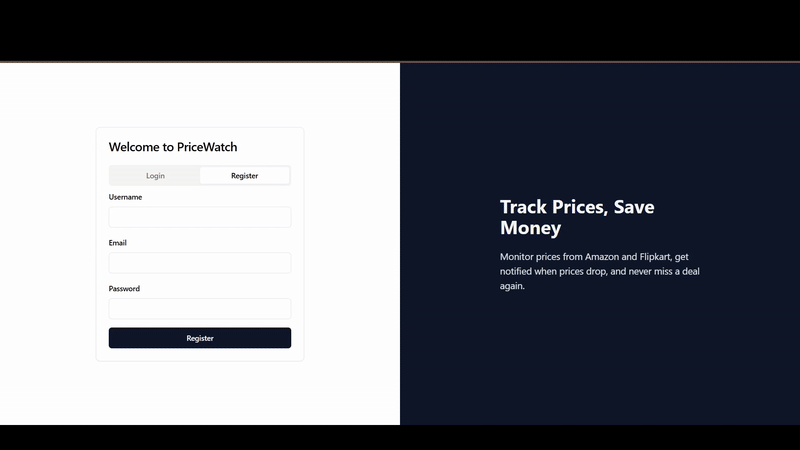

# PriceWatch 🔍

A modern web application for tracking product prices from popular e-commerce platforms. Get notified when prices drop to your target price!


## Features ✨

- **User Authentication**: Secure signup and login system
- **Product Tracking**: Monitor prices from Amazon and Flipkart
- **Price History**: View historical price trends with interactive charts
- **Price Alerts**: Set target prices and get notified when prices drop
- **Responsive Design**: Works seamlessly on desktop and mobile devices

## Tech Stack 🛠️

- **Frontend**: React, TanStack Query, Tailwind CSS, shadcn/ui
- **Backend**: Express.js, PostgreSQL with Drizzle ORM
- **Authentication**: Passport.js with session-based auth
- **Charts**: Recharts for price history visualization

## Getting Started 🚀

1. Clone the repository
2. Install dependencies:
   ```bash
   npm install
   ```
3. Set up environment variables:
   - `DATABASE_URL`: PostgreSQL connection string
   - `SESSION_SECRET`: Secret for session management

4. Run database migrations:
   ```bash
   npm run db:push
   ```

5. Start the development server:
   ```bash
   npm run dev
   ```

## Usage 📱

1. Register for an account or login if you already have one
2. Click "Add Product" on the dashboard
3. Enter the product URL from Amazon or Flipkart
4. Set your target price
5. Monitor price trends and get notified when prices drop!

